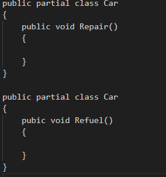

# Partial 클래스와 협업
## partial 클래스란?
클래스를 여러 파일에 정의할 수 있는 기능으로 논리적으로 하나인 클래스의 내용을 다른 파일로 분할 해 한번에 컴파일 할 수 있는 기능이다.

## partial 구현법

클래스나 메소드 앞에 partial 키워드를 사용해 구현 할 수 있다.

## partial 사용 이유
큰 규모의 코드를 개발할 때 여러 개발자가 협업을 하면 동시에 하나의 클래스나 구조체를 작성할 경우가 있다. 이런 상황에서 partial 을 사용하면 하나의 클래스를 각자 나누어 작성하여 동시에 작성하더라도 서로 영향을 주지 않고 협업을 진행 할 수 있는 장점이 있다. 

또한 하나의 파일에 모든 코드를 작성할 경우 가독성이 낮아지고 수정이 힘들어지는데 partial을 사용하면 코드를 분할하여 작성 할 수 있어 가독성이 좋아지고 유지보수 또한 편해진다.