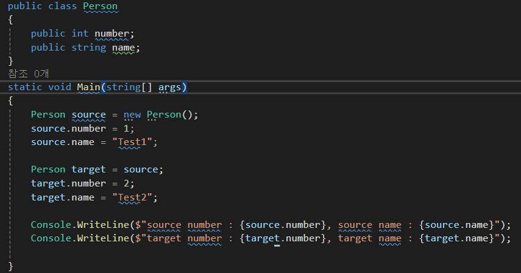
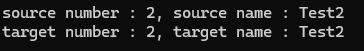
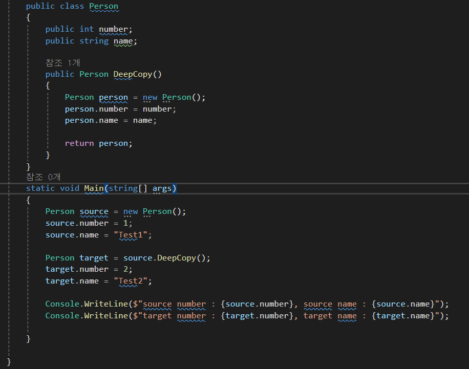
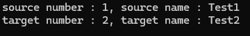

# 깊은 복사

## 깊은 복사와 참조형 변수

- 깊은 복사를 통해 생성된 객체가 가진 참조형 
변수는 기존 객체의 변수와 메모리 공간상으로 같은 위치에 존재하는가?
- 기존 변수와 새로 할당된 변수의 내용은 어떻게 다른가?
- 새로 생성된 객체의 변수 내부 사항까지 복사하려면 어떻게 해야 하는가?

얕은 복사는 객체의 참조만 복사하는 것으로 스택에 있는 참조를 복사해 복사할 객체의 참조값을 복사될 객체에 대입한다.

source를 생성하고 target에 source를 복사하면 source의 참조값을 복사해서 target에 대입한다. 즉 객체가 2개가 되는 것이 아닌 source와 target 모두 동일한 객체를 가르키게 되어 같은 값을 출력하게 된다.

깊은 복사는 객체를 복사해 새 객체를 만드는것이다. 복사할 객체인 source의 복사본을 만들어서 target에 복사할 source 객체와는 다른 복사본의 참조값을 대입한다. 그러므로 target의 번호와 이름에 새로운 값을 넣더라도 source 의 복사본에 번호와 이름을 넣는것이기 때문에 원본인 source의 값에는 변화가 없다. 

즉 서로 다른 메모리 공간을 가르킨다.
